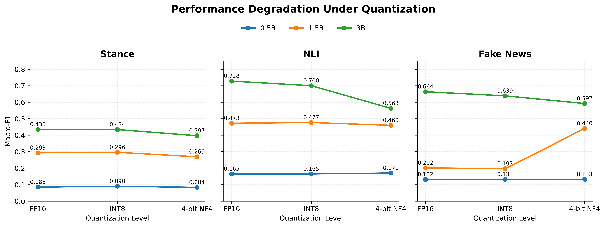

<div align="center">

# 🗜️ Bangla LLM Compression

### A Systematic Study of LLM Quantization for Low Resource Bangla Language Understanding

**Evaluating FP16, INT8, and 4 bit NF4 quantization across Qwen2.5 and Falcon3 Instruct models on Bangla Language Understanding.**

[](https://www.python.org/)

[](https://pytorch.org/)

[](https://huggingface.co/docs/transformers/)

[](https://huggingface.co/Qwen)

[](https://huggingface.co/tiiuae/Falcon3-3B-Instruct)

</div>

---

> ### 💡 TL;DR
>
> > <p align="justify">This repository contains a reproducible evaluation framework for studying small Qwen2.5 language models under FP16, INT8, and 4 bit NF4 quantization on Bangla language understanding tasks, with Falcon3 3B included for cross family validation. The project examines classification performance, model footprint, latency, throughput, checkpoint recovery, and compression behavior in resource constrained settings.</p>

---

## 📖 Overview

This project studies efficient small language models for Bangla language understanding.

<p align="justify">Three Qwen2.5 Instruct models are evaluated under multiple precision settings on three Bangla tasks. Falcon3 3B Instruct is additionally evaluated under the same settings for cross family validation. The implementation covers model loading, quantization, deterministic prompting, controlled long context handling, checkpoint based evaluation, result parsing, efficiency benchmarking, and post experiment analysis.</p>

<p align="justify">The project is motivated by the practical challenge of using capable language models in low resource languages and environments where memory and computational resources are limited.</p>

---

## 🤖 Models

<p align="justify">The experiments use three instruction tuned models from the Qwen2.5 family and Falcon3 3B Instruct as an additional model for cross family validation. </p>

| Model | Hugging Face Model |
| --------------------- | ---------------------------- |
| Qwen2.5 0.5B Instruct | `Qwen/Qwen2.5-0.5B-Instruct` |
| Qwen2.5 1.5B Instruct | `Qwen/Qwen2.5-1.5B-Instruct` |
| Qwen2.5 3B Instruct | `Qwen/Qwen2.5-3B-Instruct` |
| Falcon3 3B Instruct | `tiiuae/Falcon3-3B-Instruct` |

<p align="justify">Using models from the same Qwen2.5 family enables a controlled comparison across model scales without introducing differences between unrelated architectures. Falcon3 3B provides an additional cross family comparison at the 3B scale.</p>

---

## 🗜️ Quantization

The implementation supports three inference settings.

| Setting | Implementation |
| ------- | ------------------------------- |
| FP16 | Half precision baseline |
| INT8 | bitsandbytes 8 bit quantization |
| 4 bit | bitsandbytes NF4 quantization |

The repository uses `int4` internally as the experiment identifier for the 4 bit NF4 configuration.

All configurations use the same evaluation examples, prompts, generation settings, and maximum input length.

---

## 📚 Evaluation Tasks

### Stance Classification

The stance task uses Bangla comments related to the July Revolution in Bangladesh.

Labels:

`Pro-Uprising`

`Neutral`

`Anti-Uprising`

<p align="justify">The task is treated as stance classification rather than ordinary sentiment classification because emotional polarity does not always represent the position expressed toward the uprising or protesting students.</p>

### Natural Language Inference

The NLI task evaluates semantic relationships between Bangla premise and hypothesis pairs.

Labels:

`Entailment`

`Neutral`

`Contradiction`

<p align="justify">Examples derived from the same premise are kept within the same partition through group aware splitting. This prevents premise leakage between train, development, and test sets.</p>

### Fake News Detection

The fake news task evaluates Bangla news articles using two labels:

`Authentic`

`Fake`

<p align="justify">Many articles contain long contexts, so the evaluation pipeline applies controlled article truncation while preserving the task instructions and chat structure.</p>

---

## 🧪 Experimental Setup

The completed Qwen2.5 experiment matrix contains:

**3 model sizes × 3 precision settings × 3 tasks = 27 official evaluations**

| Model Size | FP16 | INT8 | 4 bit NF4 |
| ---------- | ---: | ---: | --------: |
| 0.5B | ✓ | ✓ | ✓ |
| 1.5B | ✓ | ✓ | ✓ |
| 3B | ✓ | ✓ | ✓ |

Falcon3 3B is additionally evaluated under the same three precision settings and three tasks:

**1 model × 3 precision settings × 3 tasks = 9 additional evaluations**

| Model | FP16 | INT8 | 4 bit NF4 |
| ---------- | ---: | ---: | --------: |
| Falcon3 3B | ✓ | ✓ | ✓ |

The complete study contains **36 official evaluations**.

All configurations are evaluated using fixed test partitions.

### Test Sets

| Task | Test Examples |
| --------- | ------------: |
| Stance | 982 |
| NLI | 1,253 |
| Fake News | 851 |

The official experiments use a maximum input length of **4096 tokens**.

Generation is deterministic.

```yaml
max_new_tokens: 8
do_sample: false
temperature: null
```

---

## 📏 Evaluation Metrics

The primary evaluation metric is **Macro F1**.

Additional metrics include:

1. Accuracy
2. Macro Precision
3. Macro Recall
4. Per class F1
5. Parse success rate

Macro F1 is emphasized because some tasks contain imbalanced class distributions.

---

## 📈 Compression Behavior

<p align="center">

  

</p>

The experiments show clear differences in compression behavior across model sizes and tasks.

Larger models provide stronger language understanding performance overall.

<p align="justify">INT8 generally preserves behavior close to the corresponding FP16 configuration, while 4 bit NF4 produces stronger task dependent changes. </p>

<p align="justify">The smallest model also exhibits class prediction collapse on some tasks, suggesting that model capacity can become a limiting factor before compression itself becomes the dominant source of degradation.</p>

<p align="justify">Falcon3 3B is used to examine whether the observed compression behavior generalizes beyond the Qwen2.5 model family.</p>

Detailed numerical results are currently withheld while the research manuscript is being prepared.

---

## ⚡ Efficiency Analysis

The project evaluates efficiency in addition to classification performance.

Measured quantities include:

1. Model footprint
2. Peak inference memory
3. Mean inference latency
4. Median inference latency
5. Examples processed per second
6. Generated tokens per second

All efficiency configurations are benchmarked using the same hardware and standardized inference settings.

<p align="justify">The experiments show that lower precision can substantially reduce model footprint, although reduced numerical precision does not automatically produce faster inference on every hardware configuration.</p>

---

## 💾 Checkpoint and Resume

Long evaluation runs use checkpoint based recovery.

```text
checkpoint_every = 25
resume = True
```

Completed examples are identified from existing prediction files and skipped during resumed evaluation.

<p align="justify">Limited development runs and official full runs use different output filenames, preventing development predictions from contaminating final experiment checkpoints.</p>

---

## 📁 Repository Structure

```text
bangla-llm-compression/
│
├── analysis/
│   ├── final_analysis.py
│   ├── generate_figures.py
│   ├── degradation_curves.py
│   ├── retention_heatmap.py
│   ├── performance_memory_scatter.py
│   ├── compression_sensitivity_3b.py
│   └── cross_family_comparison.py
│
├── assets/
│   └── compression_degradation_curves.png
│
├── configs/
│   └── experiment.yaml
│
├── data/
│   └── create_splits.py
│
├── evaluation/
│   ├── evaluate.py
│   ├── parsing.py
│   └── prompts.py
│
├── models/
│   └── load_model.py
│
├── results/
│   ├── raw/
│   └── processed/
│
├── figures/
│
├── requirements.txt
├── .gitignore
└── README.md
```

<p align="justify">Datasets, raw prediction files, processed experiment outputs, and generated research figures are excluded from version control.</p>

---

## 🚀 Usage

Clone the repository:

```bash
git clone https://github.com/sabbir5622r/bangla-llm-compression.git

cd bangla-llm-compression
```

Install the dependencies:

```bash
pip install -r requirements.txt
```

The experiment configuration is defined in:

```text
configs/experiment.yaml
```

### Load a model

```python
from models.load_model import load_config, load_model

cfg = load_config()

model, tokenizer = load_model(
    "qwen2.5-3b-instruct",
    quantization="int8",
    cfg=cfg,
)
```

### Run an evaluation

```python
from evaluation.evaluate import evaluate

evaluate(
    model_name="qwen2.5-3b-instruct",
    task="nli",
    quantization="int8",
    split="test",
    limit=None,
    checkpoint_every=25,
    resume=True,
)
```

---

## 📝 Status

The main FP16, INT8, and 4 bit NF4 evaluations have been completed for the Qwen2.5 models and Falcon3 3B.

<p align="justify">Current work focuses on final analysis, cross family analysis, efficiency trade off analysis, error analysis, manuscript preparation, and reproducibility documentation.</p>

---

## 👤 Author

**Md Sabbir Hossen**

Student | Research Assistant

<p align="justify">Research interests include Natural Language Processing, Computer Vision, Large Language Models, Vision Language Models, and Efficient AI.</p>

GitHub: [sabbir5622r](https://github.com/sabbir5622r)

Personal Website: [sabbir-hossen.com](https://sabbir-hossen.com/)

---

<div align="center">

**Research code for efficient LLM evaluation in low resource Bangla language understanding**

</div>