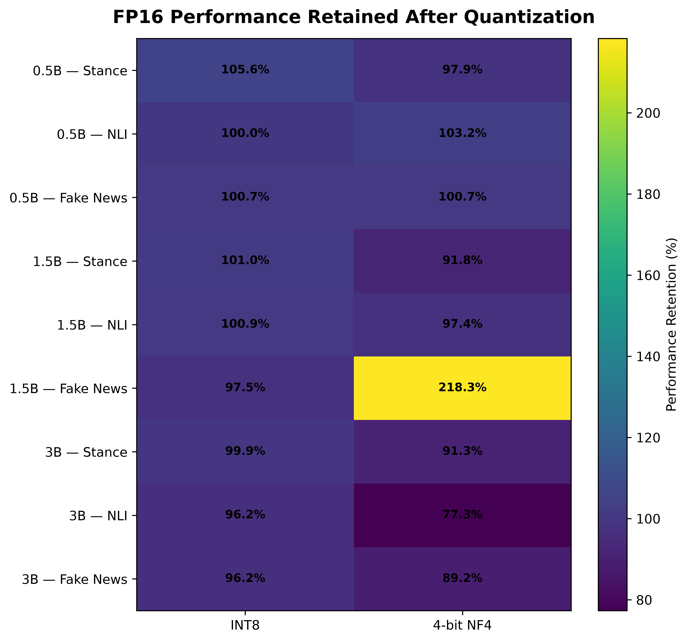
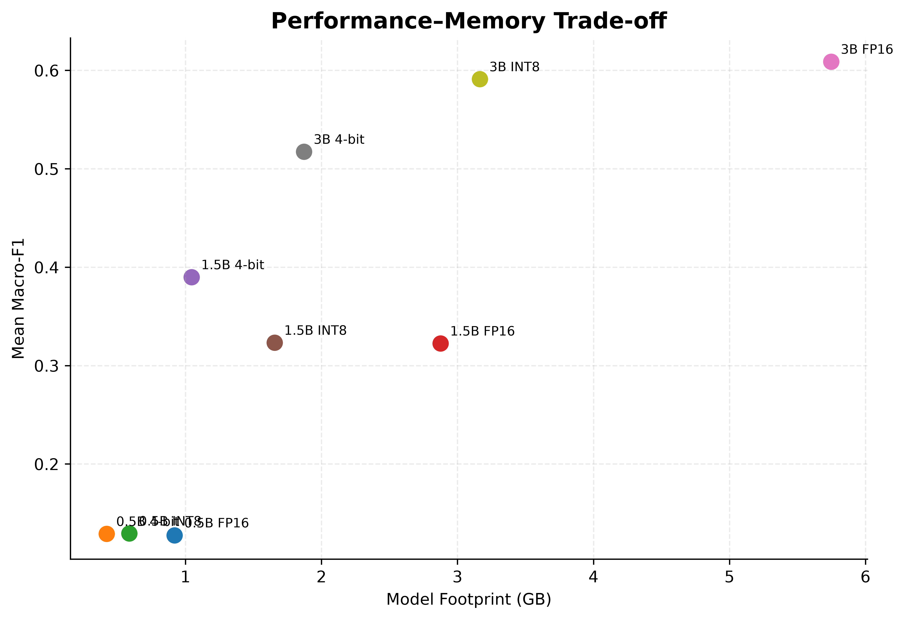

<div align="center">

# 🗜️ Bangla LLM Compression

### How Much Can We Compress an LLM Before Losing Performance on Low-Resource Language Understanding?

**A systematic study of FP16, 8-bit, and 4-bit quantization for Bangla language understanding using Qwen2.5-Instruct models**

[](https://www.python.org/)
[](https://pytorch.org/)
[](https://huggingface.co/docs/transformers/)
[](https://huggingface.co/Qwen)

</div>

---

> ### 💡 TL;DR
>
> This project studies how aggressively small language models can be quantized before their performance deteriorates on **low-resource Bangla language-understanding tasks**. Three Qwen2.5-Instruct models—**0.5B, 1.5B, and 3B**—are evaluated under **FP16, INT8, and 4-bit NF4 quantization** on **stance classification, natural language inference, and fake-news detection**. The study evaluates not only task performance but also **model footprint, inference latency, throughput, and performance retention**, with particular emphasis on the trade-off between compression and language understanding.

---

## 📖 Overview

Large language models provide strong general-purpose language capabilities, but their memory and computational requirements remain a major limitation for deployment in resource-constrained environments.

This problem is particularly important for low-resource languages such as **Bangla**, where access to large-scale computational infrastructure and specialized language models is limited.

This project investigates a simple but important question:

> **How much can a small LLM be compressed before its Bangla language-understanding performance begins to deteriorate substantially?**

Rather than treating the study as a conventional model-ranking experiment, the main objective is to analyze the interaction between:

* model capacity,
* quantization level,
* downstream language-understanding performance,
* model memory footprint,
* inference latency,
* throughput,
* and performance retention.

---

## 🎯 Research Questions

**RQ1.** How does increasing quantization aggressiveness affect small LLM performance on Bangla language-understanding tasks?

**RQ2.** How do different model sizes respond to quantization?

**RQ3.** How much memory and computational efficiency can be gained relative to the loss in language-understanding performance?

**RQ4.** What performance–efficiency trade-offs emerge across model sizes and compression levels?

---

## 🤖 Models

The experiments use three instruction-tuned models from the same Qwen2.5 family:

| Model                 | Hugging Face Model           |
| --------------------- | ---------------------------- |
| Qwen2.5-0.5B-Instruct | `Qwen/Qwen2.5-0.5B-Instruct` |
| Qwen2.5-1.5B-Instruct | `Qwen/Qwen2.5-1.5B-Instruct` |
| Qwen2.5-3B-Instruct   | `Qwen/Qwen2.5-3B-Instruct`   |

Using a single model family allows the effect of **model scale and compression** to be studied without introducing architectural differences between model families.

---

## 🗜️ Quantization Settings

Three numerical representations are evaluated:

| Setting | Implementation                  |
| ------- | ------------------------------- |
| FP16    | Half-precision baseline         |
| INT8    | bitsandbytes 8-bit quantization |
| 4-bit   | bitsandbytes NF4 quantization   |

The repository uses the internal experiment name `int4` for the 4-bit condition, while the experimental method is **4-bit NF4 quantization**.

All configurations use the same evaluation data, prompts, generation settings, and maximum input length.

---

## 📚 Bangla Evaluation Tasks

### Stance Classification

A manually created Bangla dataset concerning the **July Revolution in Bangladesh** is evaluated as a stance-classification task.

Labels:

* `Pro-Uprising`
* `Neutral`
* `Anti-Uprising`

The task is intentionally treated as **stance classification rather than generic sentiment analysis**, because emotional polarity does not necessarily correspond to political or protest stance.

### Natural Language Inference

Bangla NLI examples contain:

* premise,
* hypothesis,
* and one of three labels:

`Entailment`, `Neutral`, or `Contradiction`.

Premise-derived examples are assigned a `group_id`, and **group-aware splitting** is used to prevent hypotheses from the same premise from leaking across train/dev/test partitions.

### Fake-News Detection

The fake-news task contains Bangla authentic and fake news articles.

Labels:

* `Authentic`
* `Fake`

The dataset contains substantially longer contexts than the other tasks, so the evaluation pipeline performs **controlled article truncation while preserving the classification instructions and chat structure**.

---

## 🧪 Experimental Design

The core study consists of:

**3 model sizes × 3 quantization levels × 3 tasks = 27 official evaluations**

|                | Stance | NLI | Fake News |
| -------------- | -----: | --: | --------: |
| 0.5B FP16      |      ✓ |   ✓ |         ✓ |
| 0.5B INT8      |      ✓ |   ✓ |         ✓ |
| 0.5B 4-bit NF4 |      ✓ |   ✓ |         ✓ |
| 1.5B FP16      |      ✓ |   ✓ |         ✓ |
| 1.5B INT8      |      ✓ |   ✓ |         ✓ |
| 1.5B 4-bit NF4 |      ✓ |   ✓ |         ✓ |
| 3B FP16        |      ✓ |   ✓ |         ✓ |
| 3B INT8        |      ✓ |   ✓ |         ✓ |
| 3B 4-bit NF4   |      ✓ |   ✓ |         ✓ |

All official configurations use the same fixed test partitions.

### Test-set sizes

| Task      | Test Examples |
| --------- | ------------: |
| Stance    |           982 |
| NLI       |         1,253 |
| Fake News |           851 |

The maximum input length used in the official experiments is **4096 tokens**.

Generation is deterministic:

```yaml
max_new_tokens: 8
do_sample: false
temperature: null
```

---

## 📏 Evaluation Metrics

The primary metric is:

**Macro-F1**

Secondary metrics include:

* Accuracy
* Macro Precision
* Macro Recall
* Per-class F1
* Parse-success rate

Macro-F1 is emphasized because some tasks, particularly fake-news detection, have imbalanced class distributions.

---

## 📊 Selected Results

### FP16 baseline

| Model        |  Stance F1 |     NLI F1 | Fake-News F1 |
| ------------ | ---------: | ---------: | -----------: |
| Qwen2.5-0.5B |     0.0855 |     0.1653 |       0.1316 |
| Qwen2.5-1.5B |     0.2931 |     0.4725 |       0.2017 |
| Qwen2.5-3B   | **0.4347** | **0.7281** |   **0.6637** |

A strong model-capacity effect is observed across all three tasks.

The 0.5B model frequently exhibits **single-label prediction collapse**, whereas the 3B model produces substantially more balanced predictions and stronger class-level performance.

### Compression behavior of Qwen2.5-3B

INT8 preserves most of the FP16 performance:

| Task      | FP16 F1 | INT8 F1 | INT8 Retention |
| --------- | ------: | ------: | -------------: |
| Stance    |  0.4347 |  0.4341 |         ~99.9% |
| NLI       |  0.7281 |  0.7002 |         ~96.2% |
| Fake News |  0.6637 |  0.6388 |         ~96.2% |

More aggressive 4-bit NF4 quantization produces stronger task-dependent degradation:

| Task      | FP16 F1 | 4-bit F1 | Retention |
| --------- | ------: | -------: | --------: |
| Stance    |  0.4347 |    0.397 |    ~91.3% |
| NLI       |  0.7281 |    0.563 |    ~77.3% |
| Fake News |  0.6637 |    0.592 |    ~89.2% |

These results suggest that **8-bit quantization is largely performance-preserving for the strongest evaluated model, whereas 4-bit quantization exposes substantially greater task sensitivity**.

---

## 💾 Model Footprint

For Qwen2.5-3B:

| Quantization | Model Footprint |
| ------------ | --------------: |
| FP16         |        5.748 GB |
| INT8         |        3.164 GB |
| 4-bit NF4    |        1.872 GB |

The 4-bit configuration reduces the measured model footprint by approximately **67% relative to FP16**.

This reduction comes with task-dependent performance loss, illustrating the central performance–memory trade-off investigated in the project.

---

## 📈 Compression Analysis

<p align="center">
  
</p>

<p align="center">
  
</p>

<p align="center">
  
</p>

The analysis focuses on:

* absolute performance degradation,
* performance retention relative to FP16,
* model-size sensitivity,
* task sensitivity,
* model-footprint reduction,
* inference latency,
* throughput,
* and performance–memory trade-offs.

---

## ⚙️ Efficiency Benchmarking

Efficiency measurements are performed using a standardized inference benchmark with:

* identical hardware,
* fixed input length,
* fixed generation length,
* warm-up iterations,
* CUDA synchronization,
* and repeated timed inference.

Measured quantities include:

* model footprint,
* peak inference memory,
* mean and median latency,
* examples per second,
* generated tokens per second.

An important observation is that **lower numerical precision does not automatically produce higher inference throughput**. Runtime performance depends strongly on hardware and quantization-kernel support.

---

## 💾 Checkpoint and Resume

Long evaluation runs use checkpointing to protect against runtime interruption.

By default:

```text
checkpoint_every = 25
resume = True
```

Completed example IDs are detected from existing result files and skipped when evaluation resumes.

Limited smoke-test runs and official full runs use different result filenames, preventing development predictions from contaminating final experiment checkpoints.

---

## 📁 Repository Structure

```text
bangla-llm-compression/
│
├── configs/
│   └── experiment.yaml
│
├── data/
│   └── create_splits.py
│
├── evaluation/
│   ├── evaluate.py
│   ├── prompts.py
│   └── parsing.py
│
├── models/
│   └── load_model.py
│
├── analysis/
│   ├── final_analysis.py
│   ├── generate_figures.py
│   ├── degradation_curves.py
│   ├── retention_heatmap.py
│   ├── performance_memory_scatter.py
│   └── compression_sensitivity_3b.py
│
├── assets/
│   └── selected repository figures
│
├── results/
│   ├── raw/
│   └── processed/
│
├── figures/
│
├── requirements.txt
└── README.md
```

Raw datasets and experiment outputs are intentionally excluded from version control.

---

## 🚀 Running the Project

Clone the repository:

```bash
git clone https://github.com/sabbir5622r/bangla-llm-compression.git
cd bangla-llm-compression
```

Install dependencies:

```bash
pip install -r requirements.txt
```

The experiment configuration is defined in:

```text
configs/experiment.yaml
```

Example model loading:

```python
from models.load_model import load_config, load_model

cfg = load_config()

model, tokenizer = load_model(
    "qwen2.5-3b-instruct",
    quantization="int8",
    cfg=cfg,
)
```

Example evaluation:

```python
from evaluation.evaluate import evaluate

evaluate(
    model_name="qwen2.5-3b-instruct",
    task="nli",
    quantization="int8",
    limit=None,
    split="test",
    checkpoint_every=25,
    resume=True,
)
```

---

## 🔬 Current Research Direction

This repository is part of my broader research interest in:

* Large Language Models
* Vision-Language Models
* Multilingual and Low-Resource NLP
* Efficient and Resource-Constrained AI
* Model Compression and Optimization
* Multimodal Representation Learning

The broader goal is to understand how capable language and multimodal models can be made more practical for **low-resource languages and resource-constrained deployment settings**.

---

## 📝 Research Status

The core FP16, INT8, and 4-bit NF4 experiments have been completed.

Current work focuses on:

* final statistical and error analysis,
* performance–efficiency trade-off analysis,
* paper preparation,
* and reproducibility documentation.

---

## 👤 Author

**Md Sabbir Hossen**

Computer Science Researcher
Research interests: NLP, Computer Vision, Multimodal AI, LLMs, VLMs, and Efficient AI

GitHub: [sabbir5622r](https://github.com/sabbir5622r)

---

<div align="center">

**Research code for efficient LLM evaluation in low-resource Bangla language understanding**

</div>
