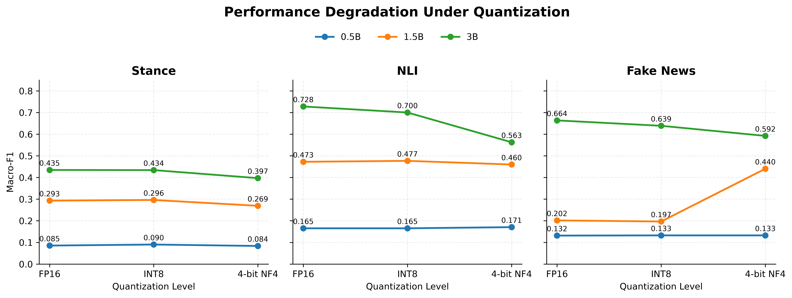

<div align="center">

# 🗜️ Bangla LLM Compression

### How Much Can We Compress Small LLMs? Quantization Trade-offs for Low-Resource Bangla Language Understanding

**A controlled study of FP16, INT8, and 4-bit NF4 quantization across Qwen2.5 and Falcon3 models on Bangla language-understanding tasks.**

[](https://www.python.org/)
[](https://pytorch.org/)
[](https://huggingface.co/docs/transformers/)
[](LICENSE)

</div>

---

> ### 💡 TL;DR
>
> This repository contains the implementation and reproducibility pipeline for our study of post-training quantization for low-resource Bangla language understanding. We evaluate Qwen2.5 models at 0.5B, 1.5B, and 3B parameters under FP16, INT8, and 4-bit NF4 across stance classification, natural language inference, and fake-news detection, with Falcon3-3B used for cross-family validation. The study jointly examines task performance, model capacity, memory footprint, latency, throughput, and compression sensitivity.

---

## 📖 Overview

Large language models provide strong multilingual capabilities, but their memory and computational requirements can make deployment difficult in resource-constrained environments. Post-training quantization offers a practical way to reduce these requirements, although its effects can vary substantially across model sizes, tasks, and languages.

This project studies how aggressively small language models can be compressed before their Bangla language-understanding performance begins to degrade.

The experiments investigate three main dimensions:

- **Model capacity:** Qwen2.5 models ranging from 0.5B to 3B parameters.
- **Quantization:** FP16, INT8, and 4-bit NormalFloat (NF4).
- **Task sensitivity:** stance classification, natural language inference, and fake-news detection.

Falcon3-3B is additionally evaluated under the same experimental settings to examine whether the observed compression behavior extends beyond the Qwen2.5 family.

The associated paper is currently **under review through ACL Rolling Review (ARR)**.

---

## 📑 Table of Contents

1. [Models](#-models)
2. [Quantization](#️-quantization)
3. [Evaluation Tasks](#-evaluation-tasks)
4. [Experimental Setup](#-experimental-setup)
5. [Main Results](#-main-results)
6. [Efficiency Analysis](#-efficiency-analysis)
7. [Repository Structure](#-repository-structure)
8. [Installation](#️-installation)
9. [Dataset Preparation](#-dataset-preparation)
10. [Running Evaluation](#-running-evaluation)
11. [Efficiency Benchmarking](#-efficiency-benchmarking)
12. [Reproducibility Notes](#-reproducibility-notes)
13. [License](#-license)
14. [Citation](#-citation)

---

## 🤖 Models

The study evaluates three instruction-tuned models from the Qwen2.5 family and one Falcon3 model for cross-family validation.

| Model | Hugging Face Model ID |
|---|---|
| Qwen2.5 0.5B Instruct | `Qwen/Qwen2.5-0.5B-Instruct` |
| Qwen2.5 1.5B Instruct | `Qwen/Qwen2.5-1.5B-Instruct` |
| Qwen2.5 3B Instruct | `Qwen/Qwen2.5-3B-Instruct` |
| Falcon3 3B Instruct | `tiiuae/Falcon3-3B-Instruct` |

Using multiple sizes from the same Qwen2.5 family enables a controlled analysis of how model capacity interacts with quantization. Falcon3-3B provides an additional comparison at approximately the same parameter scale as Qwen2.5-3B.

---

## 🗜️ Quantization

Three inference configurations are evaluated.

| Setting | Implementation |
|---|---|
| FP16 | Half-precision baseline |
| INT8 | bitsandbytes 8-bit quantization |
| 4-bit NF4 | bitsandbytes 4-bit NormalFloat quantization |

The repository uses `int4` internally as the experiment identifier for the 4-bit NF4 configuration.

The NF4 configuration uses:

```python
BitsAndBytesConfig(
    load_in_4bit=True,
    bnb_4bit_quant_type="nf4",
    bnb_4bit_compute_dtype=torch.float16,
    bnb_4bit_use_double_quant=False,
)
```

All precision settings use the same task data, prompts, generation settings, and maximum input length.

---

## 📚 Evaluation Tasks

### Stance Classification

The stance task evaluates Bangla social-media comments related to the July Revolution in Bangladesh.

Labels:

```text
Pro-Uprising
Neutral
Anti-Uprising
```

The task is formulated as stance classification rather than conventional sentiment classification because emotional polarity does not necessarily represent the position expressed toward the uprising.

### Natural Language Inference

The NLI task evaluates semantic relationships between Bangla premise-hypothesis pairs.

Labels:

```text
Entailment
Neutral
Contradiction
```

Examples generated from the same premise are kept within the same partition using group-aware splitting, preventing premise leakage across train, development, and test sets.

### Fake News Detection

The fake-news task evaluates Bangla news articles using:

```text
Authentic
Fake
```

The headline and article content are combined into a single input. Because some articles contain long contexts, the evaluation pipeline applies controlled truncation while preserving the task instructions and chat structure.

Detailed dataset sources, access information, licenses, and preparation instructions are provided in [`data/README.md`](data/README.md).

---

## 🧪 Experimental Setup

The Qwen2.5 experiment matrix contains:

**3 model sizes × 3 precision settings × 3 tasks = 27 evaluations**

| Model Size | FP16 | INT8 | 4-bit NF4 |
|---|---:|---:|---:|
| 0.5B | ✓ | ✓ | ✓ |
| 1.5B | ✓ | ✓ | ✓ |
| 3B | ✓ | ✓ | ✓ |

Falcon3-3B is evaluated under the same three precision settings and three tasks:

**1 model × 3 precision settings × 3 tasks = 9 evaluations**

| Model | FP16 | INT8 | 4-bit NF4 |
|---|---:|---:|---:|
| Falcon3 3B | ✓ | ✓ | ✓ |

The complete study therefore contains **36 model–precision–task evaluations**.

### Dataset Splits

A fixed random seed of `42` is used when constructing the experimental splits.

| Task | Train | Development | Test | Total |
|---|---:|---:|---:|---:|
| Stance | 7,850 | 981 | 982 | 9,813 |
| NLI | 10,024 | 1,251 | 1,253 | 12,528 |
| Fake News | 6,800 | 850 | 851 | 8,501 |

Stance and fake-news datasets use stratified train/development/test splitting. NLI uses group-aware splitting to ensure that examples originating from the same premise do not appear in different partitions.

### Generation Configuration

The official experiments use a maximum input length of **4096 tokens**.

Generation is deterministic:

```yaml
max_input_tokens: 4096
max_new_tokens: 8
do_sample: false
temperature: null
```

The full experimental configuration is available in:

```text
configs/experiment.yaml
```

### Evaluation Metrics

**Macro-F1** is the primary evaluation metric.

Additional metrics include:

- Accuracy
- Macro Precision
- Macro Recall
- Per-class F1
- Parse success rate

Macro-F1 is emphasized because some of the evaluation tasks contain imbalanced class distributions.

---

## 📊 Main Results

The experiments reveal a strong interaction between model capacity, task difficulty, and quantization level.

For Qwen2.5-3B:

| Task | FP16 Macro-F1 | INT8 Macro-F1 | NF4 Macro-F1 | INT8 Retention | NF4 Retention |
|---|---:|---:|---:|---:|---:|
| Stance | 0.435 | 0.434 | 0.397 | 99.9% | 91.3% |
| NLI | 0.728 | 0.700 | 0.563 | 96.2% | 77.3% |
| Fake News | 0.664 | 0.639 | 0.592 | 96.2% | 89.2% |

INT8 preserves most of the Qwen2.5-3B FP16 performance across all three tasks, while NF4 introduces substantially stronger and more task-dependent degradation.

The results also show that **model capacity matters before compression is even applied**. Qwen2.5-0.5B exhibits class-prediction collapse on some tasks under FP16, indicating that compression behavior cannot be interpreted independently of the capability of the original model.

Falcon3-3B provides cross-family evidence that quantization sensitivity is not identical across model families, reinforcing the need to evaluate compression behavior rather than assuming that a single precision setting transfers uniformly across architectures.

<p align="center">
  
</p>

---

## ⚡ Efficiency Analysis

Efficiency is evaluated alongside task performance.

The benchmark records:

- Model footprint
- GPU memory usage
- Peak inference memory
- Mean inference latency
- Median inference latency
- Examples processed per second
- Generated tokens per second

For Qwen2.5-3B on an **NVIDIA Tesla T4**:

| Precision | Model Footprint | Footprint Reduction | Generated Tokens/s |
|---|---:|---:|---:|
| FP16 | 5.748 GB | — | 11.91 |
| INT8 | 3.164 GB | 45.0% | 4.18 |
| 4-bit NF4 | 1.872 GB | 67.4% | 8.92 |

Both quantized configurations substantially reduce model footprint. However, the memory savings do not translate directly into faster inference on the tested hardware.

This highlights an important deployment trade-off: **lower numerical precision can improve memory efficiency without necessarily improving latency or throughput**.

The efficiency benchmark uses a fixed 512-token input, 3 warm-up runs, 20 measured runs, batch size 1, deterministic generation, and a maximum of 8 generated tokens.

---

## 💾 Checkpoint and Resume

Long-running evaluations support checkpoint-based recovery.

```text
checkpoint_every = 25
resume = True
```

Predictions are periodically written to disk. When an interrupted experiment is restarted with `resume=True`, completed examples are detected from the existing prediction file and skipped.

Limited development runs and complete evaluation runs use different output filenames, preventing partial test runs from being mixed with official experiment outputs.

---

## 📁 Repository Structure

```text
bangla-llm-compression/
│
├── analysis/
│   ├── compression_sensitivity_3b.py
│   ├── cross_family_comparison.py
│   ├── degradation_curves.py
│   ├── final_analysis.py
│   ├── generate_figures.py
│   ├── performance_memory_scatter.py
│   └── retention_heatmap.py
│
├── assets/
│   └── compression_degradation_curves.png
│
├── configs/
│   └── experiment.yaml
│
├── data/
│   ├── raw/
│   │   └── .gitkeep
│   ├── processed/
│   │   └── .gitkeep
│   ├── README.md
│   ├── prepare_datasets.py
│   └── create_splits.py
│
├── efficiency/
│   └── benchmark.py
│
├── evaluation/
│   ├── evaluate.py
│   ├── metrics.py
│   ├── parsing.py
│   └── prompts.py
│
├── models/
│   └── load_model.py
│
├── .gitignore
├── LICENSE
├── README.md
└── requirements.txt
```

Raw datasets, processed datasets, raw prediction outputs, processed experiment outputs, generated figures, model checkpoints, and logs are excluded from version control.

The empty `data/raw/` and `data/processed/` directories are retained using `.gitkeep` files so that the expected dataset structure is visible after cloning the repository.

---

## ⚙️ Installation

### 1. Clone the repository

```bash
git clone https://github.com/sabbir5622r/bangla-llm-compression.git
cd bangla-llm-compression
```

### 2. Create a virtual environment

```bash
python -m venv .venv
```

Activate it on Linux/macOS:

```bash
source .venv/bin/activate
```

or Windows PowerShell:

```powershell
.venv\Scripts\Activate.ps1
```

### 3. Install dependencies

```bash
pip install -r requirements.txt
```

The current model-loading implementation requires a CUDA-capable GPU for inference.

The main dependencies include PyTorch, Hugging Face Transformers, Accelerate, bitsandbytes, pandas, NumPy, scikit-learn, PyYAML, and Datasets.

---

## 📥 Dataset Preparation

Raw datasets are **not redistributed** in this repository.

See [`data/README.md`](data/README.md) for the original dataset sources, access instructions, and applicable licensing or usage conditions.

After obtaining the datasets, place the required files in:

```text
data/raw/
```

The expected raw filenames are:

```text
data/raw/
├── sentiment.csv
├── bangla_nli.csv
├── LabeledAuthentic-7K.csv
└── LabeledFake-1K.csv
```

Prepare the datasets:

```bash
python data/prepare_datasets.py
```

Then create the fixed experimental splits:

```bash
python data/create_splits.py
```

The resulting structure is generated under:

```text
data/processed/
├── stance.csv
├── nli.csv
├── fake_news.csv
└── splits/
    ├── stance/
    │   ├── train.csv
    │   ├── dev.csv
    │   └── test.csv
    ├── nli/
    │   ├── train.csv
    │   ├── dev.csv
    │   └── test.csv
    └── fake_news/
        ├── train.csv
        ├── dev.csv
        └── test.csv
```

The processed data are excluded from Git because they can be reconstructed from the original datasets using the provided preparation scripts.

---

## 🚀 Running Evaluation

### Load a Model

```python
from models.load_model import load_config, load_model

cfg = load_config()

model, tokenizer = load_model(
    "qwen2.5-3b-instruct",
    quantization="int8",
    cfg=cfg,
)
```

Available model names are:

```text
qwen2.5-0.5b-instruct
qwen2.5-1.5b-instruct
qwen2.5-3b-instruct
falcon3-3b-instruct
```

Available quantization settings are:

```text
fp16
int8
int4
```

### Run an Evaluation

For example, to evaluate Qwen2.5-3B INT8 on the NLI test set:

```python
from evaluation.evaluate import evaluate

results, metrics = evaluate(
    model_name="qwen2.5-3b-instruct",
    task="nli",
    quantization="int8",
    split="test",
    limit=None,
    checkpoint_every=25,
    resume=True,
)

print(metrics)
```

Available tasks are:

```text
stance
nli
fake_news
```

Raw prediction files are written automatically under:

```text
results/raw/
```

To perform a small pipeline check before a complete evaluation, use the `limit` argument:

```python
results, metrics = evaluate(
    model_name="qwen2.5-0.5b-instruct",
    task="stance",
    quantization="fp16",
    split="test",
    limit=25,
    checkpoint_every=25,
    resume=True,
)
```

Because limited and full evaluations use different output filenames, a small test run does not contaminate the complete evaluation checkpoint.

---

## ⚡ Efficiency Benchmarking

The efficiency benchmark is implemented in:

```text
efficiency/benchmark.py
```

Run:

```bash
python efficiency/benchmark.py
```

The script evaluates all Qwen2.5 precision configurations followed by the Falcon3-3B configurations.

Benchmark outputs are written to:

```text
results/processed/efficiency_benchmark.csv
results/processed/falcon3_efficiency_benchmark.csv
```

For comparisons with the reported efficiency numbers, the hardware environment should be considered carefully because latency, throughput, and GPU memory measurements are hardware dependent.

The reported paper measurements were obtained using an **NVIDIA Tesla T4**.

---

## 🔬 Analysis

The `analysis/` directory contains scripts used for post-experiment analysis and visualization, including:

```text
final_analysis.py
generate_figures.py
degradation_curves.py
retention_heatmap.py
performance_memory_scatter.py
compression_sensitivity_3b.py
cross_family_comparison.py
```

These scripts support the analysis of performance retention, compression sensitivity, memory-performance trade-offs, cross-family behavior, and paper figures.

Generated analysis outputs and figures are excluded from version control to keep the repository focused on code and reproducible experiment definitions.

---

## 🔁 Reproducibility Notes

The repository fixes the main experimental choices required to reproduce the study:

- Random seed: `42`
- Maximum input length: `4096`
- Maximum generated tokens: `8`
- Deterministic generation: `do_sample=False`
- Identical task splits across precision settings
- Group-aware NLI splitting
- Explicit FP16, INT8, and NF4 model-loading configurations
- Checkpoint-based recovery for long evaluations
- Separate filenames for limited and complete runs
- Fixed efficiency-benchmark input length and run counts

Model and dataset files are intentionally not stored in the repository.

Model weights are downloaded from their original Hugging Face repositories. Raw datasets must be obtained from their respective sources as described in [`data/README.md`](data/README.md).

Efficiency measurements such as latency, throughput, and GPU memory usage can vary across hardware and software environments. For direct comparison with the reported efficiency results, an NVIDIA Tesla T4 or a comparable reproduction environment should be used.

---

## 📝 Paper Status

The experiments reported in this repository accompany:

> **How Much Can We Compress Small LLMs? Quantization Trade-offs for Low-Resource Bangla Language Understanding**

The manuscript is currently **under review through ACL Rolling Review (ARR)**.

The repository will continue to preserve the experimental implementation associated with the reported study.

---

## 📄 License

The source code in this repository is released under the [MIT License](LICENSE).

Third-party datasets and pretrained model weights are **not covered by this repository's MIT License**. Their respective licenses and terms of use apply.

Dataset-specific information is provided in [`data/README.md`](data/README.md).

---

## 📚 Citation

If you use this repository, its experimental framework, or findings in your research, please consider citing the associated paper:

```bibtex
@misc{hossen2026compress,
  title     = {How Much Can We Compress Small LLMs? Quantization Trade-offs for Low-Resource Bangla Language Understanding},
  author    = {Hossen, Md Sabbir and Rahman, Anichur and Shaha, Pabon and Sung, Andrew H. and Rana, Md Shohel},
  year      = {2026},
  note      = {Under review at ACL Rolling Review}
}
```

Citation metadata will be updated when an archival publication or permanent preprint identifier becomes available.

---

<div align="center">

**Built to support reproducible research on efficient LLMs for low-resource language understanding.**  
*If this repository supports your research, consider giving it a ⭐ and citing the paper.*

</div>